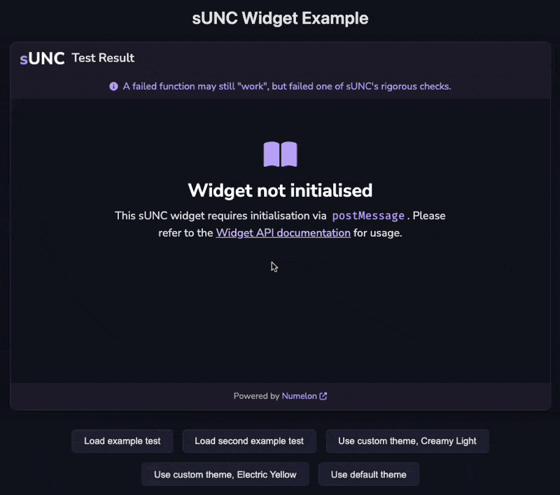

# Widget

The sUNC Embeddable Widget (SEW) allows you to embed sUNC test results as interactive widgets into other webpages via an `#!html <iframe>`. The widget is reusable and highly customiseable using it's [`#!ts postMessage` API](./postMessage-API/README.md).

This widget is ideal for developers who want to display sUNC results on status websites, show their score off on an executor website, or to use it in forums.

---

## Widget features

- Load any sUNC test result into a sandboxed viewer widget.
- Change the widget theme to match your website using a custom colour scheme.
- Dynamically control the widget through JavaScript using the [`#!ts postMessage` API](./postMessage-API/README.md).

---

## Example



You may view this example preview [here](./example/) or look at the [source code](https://github.com/sUNC-Utilities/docs.sunc.su/edit/main/docs/About/Integration-Suite/Widget/example).

---

## Usage

You can embed the widget using a standard `#!html <iframe>` and control it using the [`postMessage` API](./postMessage-API/README.md).

**The *recommended* minimum height for this widget is `#!css 610px`.**

```html title="Embedding the sUNC widget"
<iframe id="sunc-widget" src="https://sunc.rubis.app/widget/" allowfullscreen></iframe>
```

```html title="Sending a message to load a scrap (test result)"
<script>
  const iframe = document.getElementById("sunc-widget");

  iframe.contentWindow.postMessage({
    type: "sunc-widget:loadScrap",
    payload: {
      scrapId: "766F7uirM9D9ZlAF",
      key: "Hvj2XFk6nVJtJQQ9VtPoHoDpnxBDhesL"
    }
  }, "https://sunc.rubis.app");
</script>
```

Communicating with the widget may be done via the [`#!ts postMessage` API](./postMessage-API/README.md), and [message types are described here](./postMessage-API/MessageType.md).
