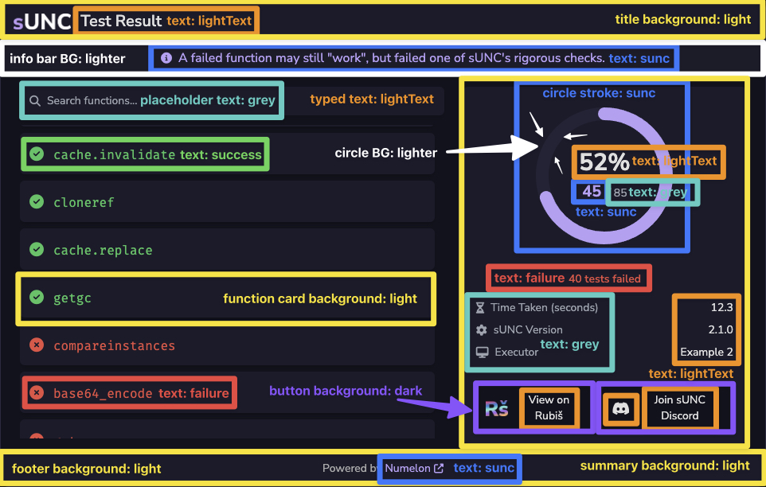
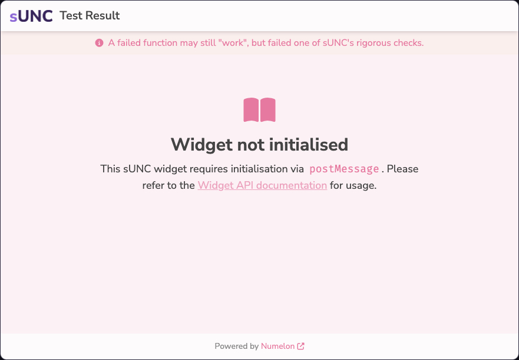
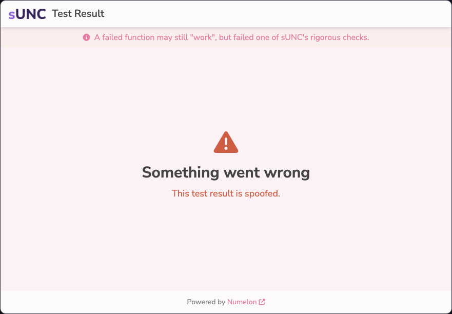
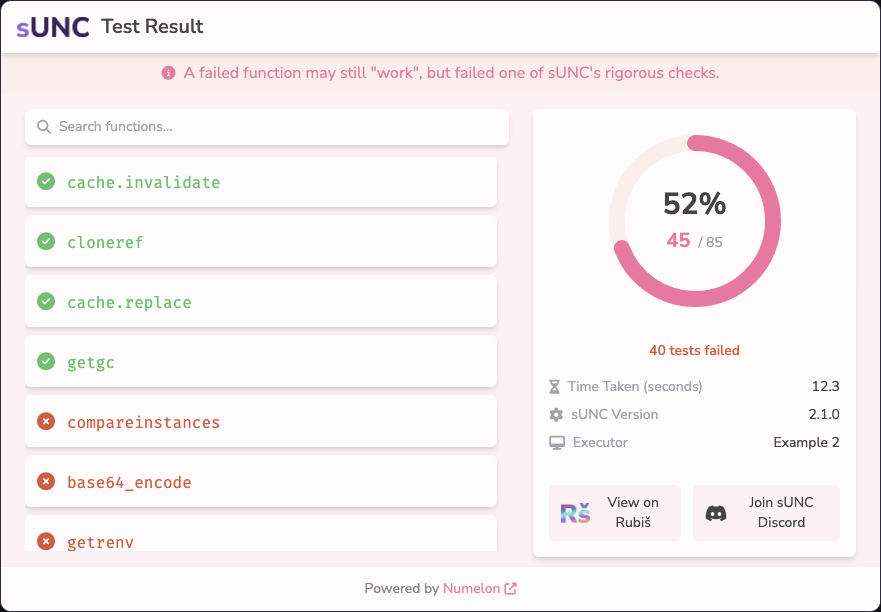
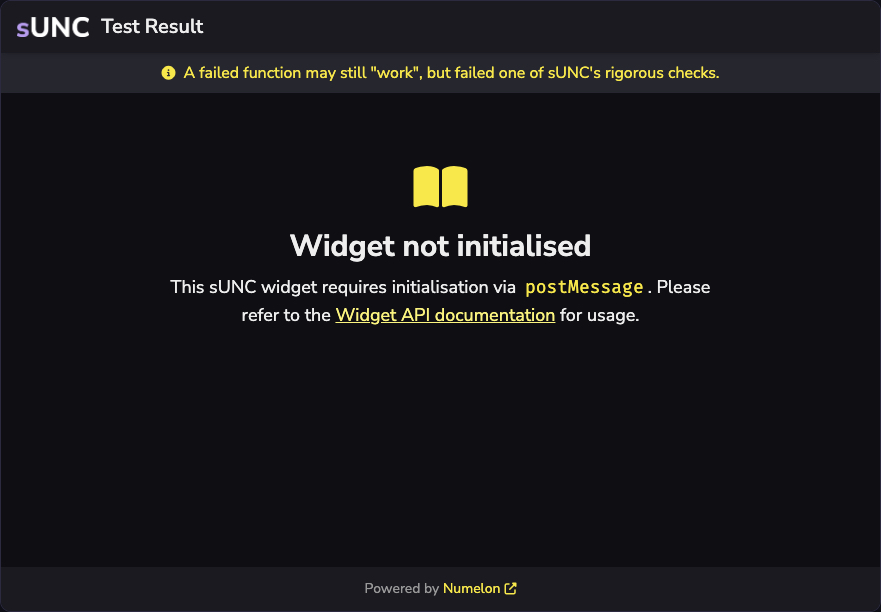
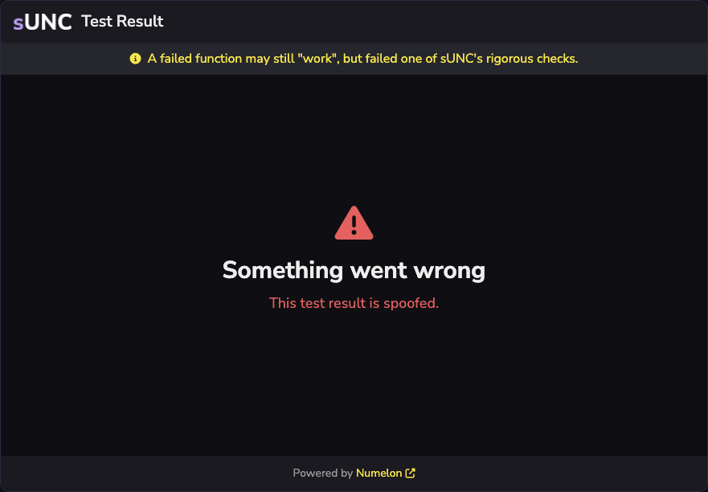
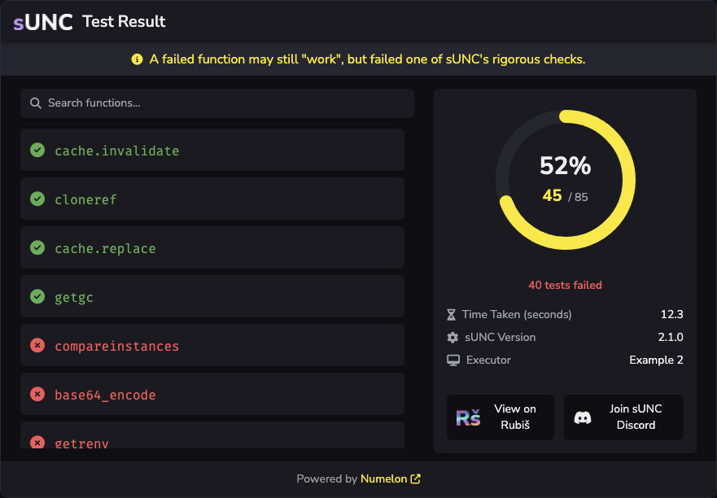
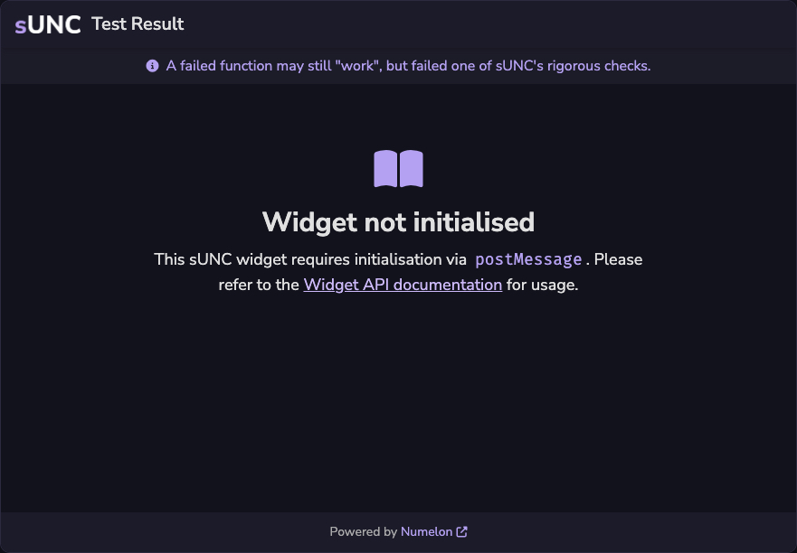
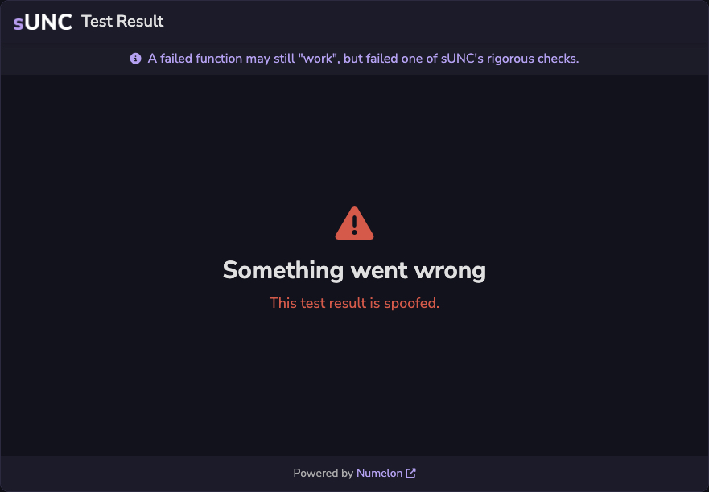
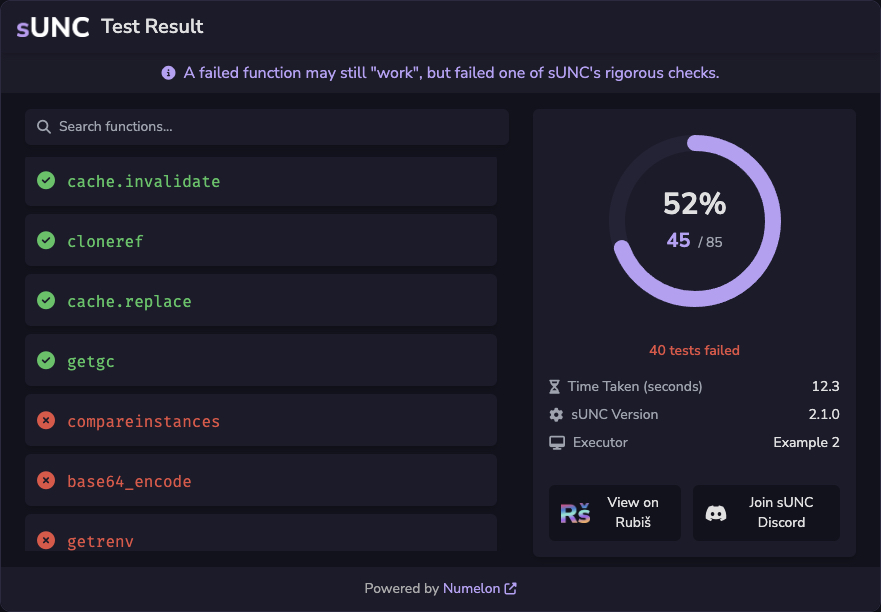

# Widget API Message Types

## `#!ts sunc-widget:loadScrap`

Loads a test result from the provided `scrapId` and `accessKey`.

```ts
type LoadScrapPayload = {
  scrapId: string;
  key: string;
};
```

### Parameters

| Parameter      | Description                               |
| -------------- | ----------------------------------------- |
| `#!ts scrapId` | The unique ID of the test result.         |
| `#!ts key`     | The access key required to view the test. |

### Example

```ts title="Load a test result" linenums="1"
iframe.contentWindow.postMessage({
  type: "sunc-widget:loadScrap",
  payload: {
    scrapId: "abc123XYZ",
    key: "someAccessKey"
  }
}, "https://sunc.rubis.app");

```

---

## `#!ts sunc-widget:setTheme`

Updates the colour theme of the widget to match your branding. Any missing fields will fall back to defaults.

```ts
type ThemePayload = {
  dark?: string;
  light?: string;
  lighter?: string;

  sunc?: string;
  suncLighter?: string;

  grey?: string;
  lightText?: string;

  success?: string;
  failure?: string;

  useDarkLogo?: boolean;
};
```

### Parameters

| Parameter          | Type          | Description                                                                                                                                                 | Default         |
| ------------------ | ------------- | ----------------------------------------------------------------------------------------------------------------------------------------------------------- | --------------- |
| `#!ts dark`        | `#!ts string` | The main background colour of the page.                                                                                                                     | `#!css #12121c` |
| `#!ts light`       | `#!ts string` | The secondary colour used for function cards and the summary on the right.                                                                                  | `#!css #1b1b2a` |
| `#!ts lighter`     | `#!ts string` | The colour of the information bar at the top.                                                                                                               | `#!css #1c1b28` |
| `#!ts sunc`        | `#!ts string` | Brand colour to be used by the info text, circle stroke and passed amount.                                                                                  | `#!css #b7a0f6` |
| `#!ts suncLighter` | `#!ts string` | Used when hovering over the Numelon link at the bottom.                                                                                                     | `#!css #d1b9ff` |
| `#!ts grey`        | `#!ts string` | Colour of the icon and placeholder text in the search box, and for metadata titles in the summary area.                                                     | `#!css #aaaaaa` |
| `#!ts lightText`   | `#!ts string` | Main readable text colour used in the widget "Test Result" title, percentage text inside the ring, and metadata values in the summary area and button text. | `#!css #e0e0e0` |
| `#!ts success`     | `#!ts string` | Colour used for successes, notably in the list of functions.                                                                                                | `#!css #22c55e` |
| `#!ts failure`     | `#!ts string` | Colour used for general failures, notably in the list of functions but also for widget errors and the "x tests failed" text.                                | `#!css #ef4444` |
| `#!ts useDarkLogo` | `#!ts string` | A boolean indicating whether a logo suited for a light theme should be used.                                                                                | `#!ts true`     |

### Explanation of Colours

In hindsight, the naming of colours above actually seems slightly deceptive, and ideally they ought to be called `primary`, `secondary`, `tertiary`, etc. However, the naming aligns with what you see on the sUNC Embeddable Widget (SEW) by default.

The image below visually presents parts of the SEW with the colour names they are associated with - and the names start to make much more sense. For example, the primary background colour of the entire page is a very dark blackish-purple, which aligns with the colour name `#!ts dark`.



### Logo Comparison

The sUNC logo shown in the top left of the widget can be customised depending on whether you intend to use a light theme or a dark theme. This is important to get right, otherwise you will have horrible contrast in the title bar of the widget.

If `#!ts useDarkLogo` is omitted entirely, then the widget defaults to `#! true` - it uses the dark logo by default.

#### `#!ts useDarkLogo: false`

When `#!ts useDarkLogo` is set to `#!ts false`, a light variant is used. This is perfect for when the background is dark as it provides enough contrast.

**Use this when you have a dark theme.**


#### `#!ts useDarkLogo: true`

When `#!ts useDarkLogo` is set to `#!ts true`, a dark variant is used. This is perfect for when the background is light as it provides enough contrast.

**Use this when you have a light theme.**


### Examples

#### Example 1

??? info "Preview of the Creamy Pink theme"
    Not Initialised
    

    Spoofed
    

    Result
    

```ts title="Apply a light, creamy pink theme" linenums="1"
iframe.contentWindow.postMessage({
    type: "sunc-widget:setTheme",

    payload: {
        dark: "#fff0f5",
        light: "#fffbfc",
        lighter: "#ffeeee",

        sunc: "#ff6aa0",
        suncLighter: "#ff9abe",

        grey: "#888",
        lightText: "#444",

        success: "#44c26a",
        failure: "#e74c3c",

        useDarkLogo: true // (1)
    }
}, "https://sunc.rubis.app");
```

1. Set this to `#!ts true` when using light background colours.

#### Example 2

??? info "Preview of the Electric Yellow theme"
    Not Initialised
    

    Spoofed
    

    Result
    

```ts title="Applying a dark, electric yellow theme" linenums="1"
iframe.contentWindow.postMessage({
    type: "sunc-widget:setTheme",

    payload: {
        dark: "#0f0f12",
        light: "#1a1a20",
        lighter: "#26262f",

        sunc: "#ffe600",
        suncLighter: "#fff36b",

        grey: "#999999",
        lightText: "#eeeeee",

        success: "#4caf50",
        failure: "#ff4b5c",

        useDarkLogo: false // (1)
    }
}, "https://sunc.rubis.app");
```

1. Set this to `#!ts false` when using dark background colours.

#### Example 3

??? info "Preview of the Default theme"
    Not Initialised
    

    Spoofed
    

    Result
    

```ts title="Applying a dark, electric yellow theme" linenums="1"
iframe.contentWindow.postMessage({
    type: "sunc-widget:setTheme",

    payload: {} // (1)
}, "https://sunc.rubis.app");
```

1. To revert back to the default theme, one may simply pass a message with an empty payload using the `postMessage` API.
