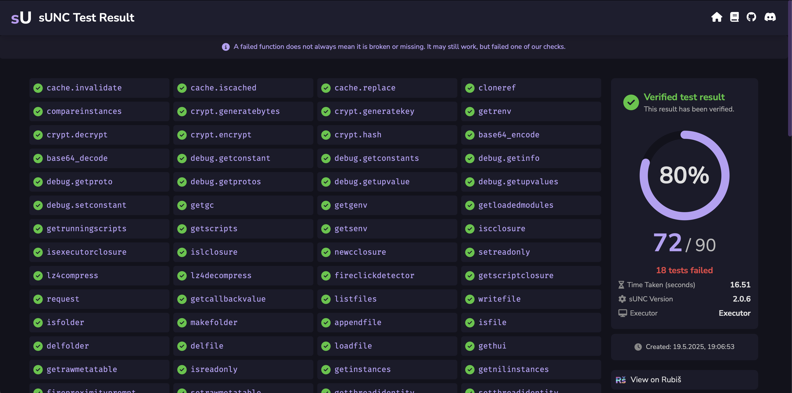

# How do test results work?

sUNC is known for its incredible accuracy and strict tests. Ever since it was made, it was ***literaly*** built to expose falsified environments and spoofed globaly by actually invoking functions and testing their functionality - not just checking for their presence.

Unlike older solutions (e.g. UNC), sUNC ensures your environment is functionally capable, not superficially compliant.

---

## Using the dedicated game

As of **sUNC V2**, all tests must be conducted in the official sUNC testing game. This game may be found in our [discord server](https://discord.gg/FNNfTUpFYv).

This move was not aesthetic (we know that very well, because who finds the furries in the game aesthetic?), it was essential.

Running tests in our dedicated game provides:

- A controlled, consistent game with no interference
- Improved test integrity that is free from manipulation
- A stable testing framework that ensures every run is identical in logic and execution
- Stronger security, especially against spoofed or pre-modified results. People can no longer just use something like `#!lua string.find()` from within their environment to find the sUNC Script URL and replace it with their own test - because without a Rubiš link, there is no test result.

This environment is tightly integrated with sUNC's backend systems, removing any ambiguity in how the test was run or how results are retrieved.

---

## Viewing your test results

Once your test is complete, sUNC will generate a short redirect link via [melon.nu](https://melon.nu) like this:

This generated link redirects to a beautiful, dynamic viewer hosted on **Numelon Rubiš**:

The results page offers a clean, visually appealing UI that lays out which functions passed and which failed, verified badges (when the test is legitimate), and cryptographic guarantees of authenticity.

---

## Verified integrity. No Spoofs

Rubiš doesn't just store your sUNC test results, it also **verifies** them.

- Every result is **cryptographically signed** by the sUNC test game servers
- The Rubiš backend **checks this signature**
- Any tampered or faked data is **instantly flagged as unverified**
- Verified results are styled differently, making trust effortless

Even if someone tries to replicate the link or manually upload fake data and use it with the results viewer (since [Rubiš is also a public paste service](https://rubis.numelon.com) which is usable by anyone), it will not pass.
